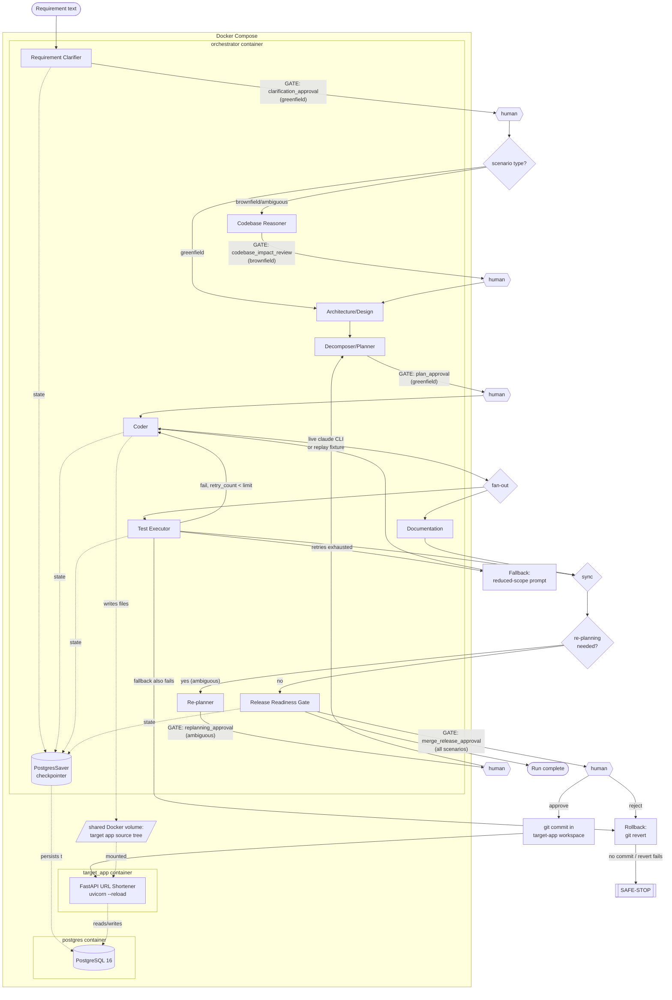

# Architecture Overview

## What this is

An agentic SDLC orchestrator built on a real [LangGraph](https://github.com/langchain-ai/langgraph)
`StateGraph`. Given a plain-English requirement, it clarifies intent, reasons about
an existing codebase where relevant, designs a change, decomposes it into tasks,
generates code via a real LLM, tests it, documents it, and — subject to human
approval at every high-impact step — merges it. The target of that work is a small
FastAPI URL-shortener service; the orchestrator itself is what's being evaluated.

## Component diagram

## Orchestration model

**Every node is a plain Python function taking `GraphState` and returning a partial
update.** Only the Coder node calls an LLM (the standalone `claude` CLI via
subprocess); every other node is deterministic, heuristic logic that runs
identically in `live` and `replay` mode. This matters for two reasons: it makes
eight of the nine nodes trivially unit-testable with no mocking, and it means
replay fidelity only has to solve one hard problem (reproducing what the LLM did),
not nine.

**Human approval gates are real `langgraph.types.interrupt()` calls, not a
simulated pause.** In live mode, `interrupt()` genuinely suspends the graph and
surfaces the gate's payload for a terminal prompt. In replay mode, the same
`interrupt()` fires — the *only* difference is who answers it: the scenario runner
looks up the recorded decision from that scenario's fixture and resumes via
`Command(resume=decision)`. The graph cannot tell the difference. This was
validated directly (`orchestrator/tests/test_nodes_*.py`) by resuming the same
interrupt with both a synthetic "human" decision and a fixture-recorded one and
confirming identical downstream behavior.

**Gate placement is distributed across the three scenarios**, not all five gate
types demoed in one run:

| Gate | Fires on | Rationale |
|---|---|---|
| `clarification_approval` | greenfield only | A net-new feature is where ambiguity in *what to build* matters most |
| `codebase_impact_review` | brownfield only | Only brownfield/ambiguous have existing code to assess, and only brownfield gates on it (see Codebase Reasoner below) |
| `plan_approval` | greenfield only | Pairs with clarification — greenfield gets the fullest human-in-the-loop treatment since it's the least constrained |
| `replanning_approval` | ambiguous only | This is the scenario built specifically to demonstrate re-planning |
| `merge_release_approval` | **every scenario** | The final checkpoint before any commit always requires approval, regardless of scenario |

## Graph nodes (single-responsibility)

| Node | Responsibility | Notes |
|---|---|---|
| **Requirement Clarifier** | Parses raw input, flags vague qualifiers/underspecified text as ambiguities, normalizes into `requirement_clarified`. | Gates only on greenfield. |
| **Codebase Reasoner** | Lightweight keyword scan over the target-app workspace (not an LLM call) classifying matched files as impacted modules vs. APIs. For the ambiguous scenario specifically, also runs a deterministic conflict check (does `app/*rate_limit*.py` already exist?) that can trigger re-planning. | **Skipped entirely on greenfield** via an explicit conditional edge — no code to reason about. Gates only on brownfield. |
| **Architecture/Design** | The *how*: heuristic framing of the change (net-new component vs. in-place modification) from the clarified requirement plus Codebase Reasoner's output. | No gate — not in the five-gate distribution. |
| **Decomposer/Planner** | The *what/when*: a small deterministic task list whose dependencies mirror the graph's own Coder → (Test, Docs) → Release topology. Also produces the **revised** plan after a re-planning gate resolves — a real, different task list (an added reconciliation task), not a relabeled copy. | Gates only on greenfield (`plan_approval`). |
| **Coder** | The only LLM-calling node. Live mode: `claude -p <prompt> --model claude-sonnet-5 --output-format json`, run with `cwd` set to the actual target-app workspace (see "Coder node internals" below). Replay mode: reads the matching attempt from `orchestrator/fixtures/<scenario>/transcript.json`. | No gate directly, but every failure mode (missing fixture, CLI error, malformed JSON) converts to a clean `safe_stop` rather than an uncaught exception. |
| **Test Executor** | Runs `pytest` against the current workspace via a sandboxed `subprocess.run` (explicit timeout, scoped `cwd`). Owns the retry → fallback state-transition bookkeeping. | Runs in parallel with Documentation. |
| **Documentation node** | Deterministic templating (not an LLM call) of a target-app change-log doc from the design summary, generated files, and task list. | Runs in parallel with Test Executor — this is the graph's one genuine fan-out/join. |
| **Release Readiness Gate** | *Is* the merge/deploy checkpoint, not a separate concept. Runs the three guardrail checks, then gates. On approval, commits code+docs together as one real commit in the target app's own nested git history. | Gates on **every** scenario. |
| **Re-planner** | The ambiguous scenario's mid-flight checkpoint: surfaces the detected conflict and the current task list, gates, hands control back to Decomposer/Planner for a genuinely revised plan. | Gates only on ambiguous. |

## State model

`GraphState` (Pydantic, `orchestrator/state.py`) carries, among other fields:

- **Gate records** (`dict[GateType, GateRecord]`) — one entry per gate actually
  fired this run, recording status, who decided, and whether it was replayed.
- **`coder_attempts`** (`Annotated[list[CoderOutput], operator.add]`) — every
  Coder invocation across a retry loop, not just the latest. Added after
  discovering that a single `coder` field silently lost earlier failed attempts,
  which undermined both fixture capture (which needs every attempt) and audit
  fidelity (which should be able to show *why* a retry happened).
- **`events`** (`Annotated[list[AuditEvent], operator.add]`) — the append-only
  audit trail every telemetry sink and every metric is computed from. Uses the
  same additive-reducer pattern as `coder_attempts`, needed because Test Executor
  and Documentation write to it concurrently.
- **`route_hint`** — set explicitly by Test Executor (`proceed | retry |
  fallback_attempt | rollback`) rather than re-derived by the router from raw
  counters. `fallback_triggered=True and test failed` is genuinely ambiguous on
  its own between "about to try the fallback attempt" and "the fallback attempt
  just failed too" — the node with full before/after context resolves that
  ambiguity at the moment it happens, not the router downstream.
- **Retry/rollback/safe-stop counters and flags**, and `finished_at` (set on every
  terminal path — release approval, safe-stop, rollback) feeding the e2e-latency
  metric.

## Governance model

Concrete, not aspirational:

- **Retry**: same node, same input, re-attempted while `retry_count < retry_limit`
  (default 3).
- **Fallback**: retries exhausted → the *next* Coder call uses a reduced-scope
  "simplest possible implementation" prompt instead of the normal one.
- **Rollback**: the fallback attempt also fails → `git reset --hard` **plus**
  `git clean -fd` to the last commit that existed before this run's Coder wrote
  anything. (The `clean -fd` was not in the first version — `reset --hard` alone
  leaves untracked files on disk, which is exactly what an uncommitted Coder
  attempt is. Found via integration testing, now covered by a dedicated
  regression test.)
- **Safe-stop**: rollback has nothing to revert to, or the revert itself fails →
  halt the graph, mark the run `failed`, persist the full audit trail. Never
  silent, never a bare exception — every safe-stop path returns a clear rationale
  string.
- **Guardrails** (checked at Release Gate, before merge eligibility): (1) unsafe
  calls (`eval`/`exec`/`os.system`/`shell=True`) block the merge unless the human
  decision explicitly sets `override_guardrails=True` — **and this is enforced
  regardless of what the raw approve/reject status says**, as defense in depth
  against a human clicking "approve" without noticing a flagged violation; (2)
  DDL/schema-altering statements are flagged the same way; (3) secret-shaped
  strings are flagged the same way. Mapped to policy intent: (1) is a security
  concern (arbitrary code execution), (2) is a change-control concern (schema
  changes routed through explicit review rather than landing silently), and (3)
  serves both security and compliance (credential/PII leakage prevention) at
  once — one rule, two policy concerns, rather than a forced 1:1 split.
- **Telemetry**: one `AuditEvent` stream, two projections — a JSON-lines file
  (`orchestrator/telemetry.py`'s `TelemetrySink`, one record per node
  execution/gate/retry/rollback) and a derived console trace. Not two
  independently-maintained logs.
- **Metrics** (`orchestrator/metrics.py`): success rate = completed runs / total;
  retry frequency = total retries / total Coder invocations; rollback frequency =
  total rollbacks / total runs; MTTR = time between a run's first Test Executor
  failure and its next pass; e2e latency = wall-clock start to finish. Validated
  against hand-calculated values across synthetic runs before being trusted on
  real ones.

## Coder node internals

The Coder node is where most of the real engineering problems in this build
surfaced, because it's the one node that leaves the orchestrator's control (a
subprocess call to an agentic CLI with its own file-system tool access):

- **Dependency-aware prompting.** The first live greenfield capture attempt failed
  because Claude reasonably reached for the `qrcode` package, which nothing had
  told it was (or wasn't) available. There's no dynamic dependency-installation
  step in this architecture — an unlisted import is a guaranteed failure no matter
  how correct the rest of the code is. `_build_prompt` now reads the workspace's
  own `requirements.txt` and states exactly what's installed.
- **Task-plan visibility.** The ambiguous scenario's first capture attempt burned
  all four Coder attempts (three retries plus the fallback) because it rewrote
  `app/models.py` without updating its importers — a real cross-file consistency
  failure traced to the prompt never including the Decomposer/Planner's task list
  at all. The whole point of the re-planning mechanism is a *revised, more
  specific* task list; if Coder never sees it, re-planning only ever affects
  orchestrator bookkeeping. Fixed by including `state.tasks` in the prompt, plus
  an explicit instruction that a breaking change to a shared module must include
  every file that imports it, in the same response.
- **Working directory.** `claude -p` runs the full agentic Claude Code CLI with
  file-system tool access, not a bare completion call. Without an explicit `cwd`,
  it orients itself on whatever directory the orchestrator process happens to be
  running in — observed taking 46 tool-use turns and 455 seconds exploring the
  wrong tree (the whole monorepo) before finally answering, and prefixing its JSON
  with a short narration despite explicit "no prose" instructions. Fixed by
  passing `cwd=workspace`; JSON parsing was also hardened to fall back to locating
  the outermost `{...}` substring if strict parsing fails, as defense in depth.
- **Transient CLI failures.** The `claude` CLI occasionally returned an empty or
  malformed response on an otherwise healthy call — observed multiple times
  during development, distinct from "the generated code is wrong." A small bounded
  retry (2 attempts) at the subprocess-call layer handles this, separate from the
  outer `retry_count` mechanism that handles actual test failures.

## Docker Compose topology

Three services: `postgres` (checkpointer durability + target-app database),
`target_app` (the FastAPI service, served via `uvicorn --reload`), `orchestrator`
(runs `run_all_scenarios.py` by default, then exits 0). `orchestrator` and
`target_app` share a **named Docker volume**, auto-populated from `target_app`'s
own image content on first mount — deliberately never a bind mount to the host's
tracked source, so a demo run can never mutate the actual git-tracked
`target_app/` files.

**Why each scenario gets its own scratch copy rather than one cumulative shared
workspace.** The first version had `run_all_scenarios.py` write all three
scenarios' changes into the one live-served volume, so a reviewer watching
`target_app`'s logs would see it reload three times as the app evolved. It broke
on the third scenario: the ambiguous fixture's captured `app/main.py` (recorded
against a clean baseline) silently overwrote the QR-router registration
greenfield's own fixture had just added, failing greenfield's own test. Fixtures
are captured independently and were never validated to compose against each
other's changes. Correctness across all three demos matters more than the
live-reload narrative, so each scenario now runs against its own fresh copy of the
baseline; the live `target_app` service stays at baseline throughout the default
run. (`scenarios/_runner.py`'s `run_scenario()` still accepts an explicit
workspace, so pointing one scenario at the real shared volume directly remains
possible for anyone who wants to see a single change land live.)

## Credential boundary

There is no `ANTHROPIC_API_KEY` anywhere in this system, optional or otherwise.
The Coder node's live mode authenticates via the operator's own `claude` CLI OAuth
session, which lives on the **host**, not in any container. Two consequences:

1. **Fixture capture is a host-only, one-time build activity**
   (`orchestrator/scripts/capture_fixture.py`), never run inside Docker — there's
   no reason to fight container credential isolation for something the
   reviewer-facing stack doesn't need.
2. **The `--live` path inside Docker requires an explicit opt-in**:
   `docker-compose.override.yml` (gitignored, copied from the committed
   `.example` file) bind-mounts the host's `~/.claude` into the orchestrator
   container read-only. The default `docker-compose.yml` a reviewer runs has no
   such mount and structurally cannot reach live mode — not a policy restriction,
   a missing credential.

## Considered and rejected

- **Spring Boot for the target app.** Rejected in favor of Python/FastAPI: the
  Coder → Test Executor retry loop runs repeatedly across three scenarios, and a
  JVM compile+startup cycle adds real time per iteration versus near-instant
  Python reload + pytest. Same-language orchestrator and target app also means
  generated code can be imported and exercised in-process by Test Executor with no
  compile step. Orchestration effectiveness is weighted above target-app language
  pedigree in what's being evaluated here.
- **Full user authentication on the target app.** Reopened mid-build after direct
  pushback that "no auth" wasn't production-grade. Resolved with a lightweight
  shared-secret API key on write/analytics endpoints rather than full accounts —
  see `docs/final_summary.md` for the reasoning.
- **Alembic migrations.** `Base.metadata.create_all()` on startup instead — real
  production practice would use proper migrations; not worth the time cost at this
  scope. Documented as a known gap, not hidden.
- **In-memory LangGraph checkpointer for production.** Approval gates pause
  execution for real; an in-memory checkpointer would silently lose a pending-gate
  run if the orchestrator container restarted mid-demo. `PostgresSaver` is used
  for the real deployment; `MemorySaver` remains available for fast,
  dependency-free unit tests.
